# Dustforce DX Beginner to Intermediate Guide #

*by czyys*

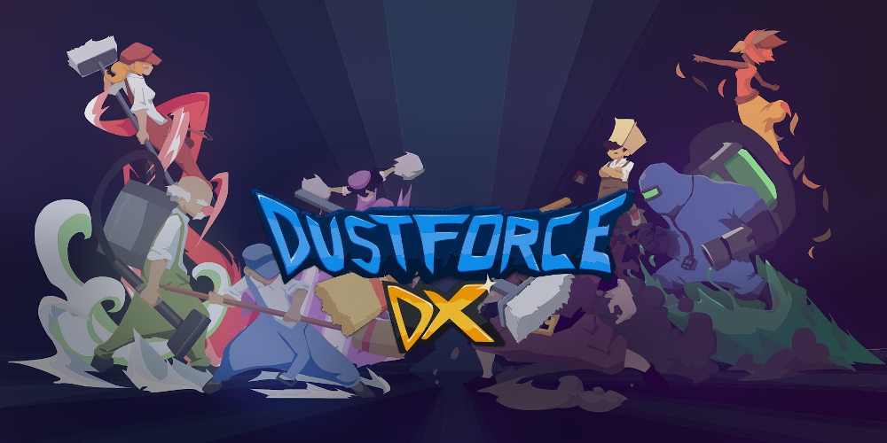

 

## Table of Contents ##

* [Introduction](#introduction)  
* [Before you begin](#before-you-begin)  
	* [Helpful tools](#helpful-tools)
	* [Keyboard or Controller](#keyboard-or-controller)
	* [Controls scheme](#controls-scheme)
	* [Dustmod settings](#dustmod-settings)
	* [Basics](#basics)
	* [Characters and their differences](#characters-and-their-differences)
	* [General mindset](#general-mindset)
* [Movement](#movement)
	* [Dash to move](#dash-to-move)
	* [How dashing works](#how-dashing-works)
	* [Downdash](#downdash)
	* [Jumping](#jumping)
	* [Neutral jump](#neutral-jump)
	* [Wallrun](#wallrun)
	* [Walljump](#walljump)
	* [Walldash](#walldash)
	* [Corner boosts](#corner-boosts)
	* [Ceiling run](#ceiling-run)
	* [Ground boosting](#ground-boosting)
	* [Slope boosting](#slope-boosting)
	* [Dash rhythm](#dash-rhythm)
	* [Slant boosting](#slant-boosting)
	* [Ledge jump](#ledge-jump)
	* [Ledge cancels and Mantles](#ledge-cancels-and-mantles)
	* [Slopejump](#slopejump)
	* [Spikejump](#spikejump)
	* [Zetta slides in Zetta Difficult](#zetta-slides-in-zetta-difficult)
* [Combat](#combat)
	* [Clearing dust through walls](#clearing-dust-through-walls)
	* [Dust spread](#dust-spread)
	* [Changing directions of attacks](#changing-directions-of-attacks)
	* [Super attack](#super-attack)
	* [Buffering](#buffering)
	* [Canceling recovery animations of attacks](#canceling-recovery-animations-of-attacks)
	* [Spring blobs](#spring-blobs)
* [More advanced stuff](#more-advanced-stuff)
	* [Holding 'left' and 'right' at the same time](#holding-left-and-right-at-the-same-time)
	* [Dashjump](#dashjump)
	* [Mapler slide](#mapler-slide)
	* [Hitrise](#hitrise)
	* [Hitstop](#hitstop)
	* [Jorf](#jorf)
	* [Spikestand](#spikestand)
	* [Clipping](#clipping)
	* [Facing](#facing)
	* [Deadleg](#deadleg)
	* [Super attack cancel](#super-attack-cancel)
	* [Time dilation](#time-dilation)
	* [Left friction](#left-friction)
	* [Iteration order](#iteration-order)
* [Getting better](#getting-better)
	* [Improving ranks](#improving-ranks)
	* [Using editor anywhere](#using-editor-anywhere)
	* [Comparing replays on dustkid.com](#comparing-replays-on-dustkid)
	* [Replay ghosts](#replay-ghosts)
	* [Other resources](#other-resources)
* [Closing words and credits](#closing-words-and-credits)

\
<a name="introduction"/>

## Introduction ##

This guide is made for players only beginning their journey with Dustforce DX as well as players already with the Steam achievement. It doesn't contain any level specifc help, as it would make it grow to enormous sizes, and instead focuses on explaining general mechanics and techniques. Players thinking about, or maybe even set on climbing stock maps’ leaderboards in the long run should find it especially helpful. 

It provides information I wish I had an easy access to when I was learning the game myself, so it’s just my own perspective and input on improving your skills. I’m a mostly inactive Dustforce player with a little over 2000 hours of playtime, most of which was spent on playing custom maps, the rest on playing stock maps and making my own customs. I’ve had ideas popping into my head for a guide like this for a long time, in fact my very first custom map was an attempt at a simple tutorial level, which is now hidden on Atlas as it became obsolete with the release of this guide.

\
<a name="before-you-begin"/>

## Before you begin ##

I want to emphasize that you’re not meant to complete this guide in one go, before moving on to playing any nexus maps. This guide covers techniques which some players start learning only after getting SS on most of the stock maps. Go through it at your own tempo, leave it after learning new tech, play some maps then come back later. You can also go through “Movement” and “Combat” sections independently.

If you’ve only began playing Dustforce I recommend not focusing on climbing up the leaderboards just yet. First get comfortable with controls and physics of your character by getting SS ranks on some maps in the nexus.

  

<a name="helpful-tools"/>

### Helpful tools ###

* Get Dustmod from http://dustmod.com/. It has many great features some of which are very useful for getting better at the game. If you already completed some stock levels and want to copy over your progress then start Dustmod, when in-game go to Dustmod → Tools → Save → Download. It may mess up info at the bottom about the keys you’ve gotten. As far as I know you can continue playing and everything should end up fine.
* On https://dustkid.com/ you can find information about your Dustforce profile with all the replays you submit. Once you finish playing any level open the site and it should ask about confirming your profile. Another thing worth taking care of right now is enabling watching replays from the dustkid website and for this you need to run dustmod.exe just once as an administrator. After this you have to run it normally.

If you run into any technical difficulties during these two steps ask people from Dustforce community for help over at r/dustforce or in the Dustforce Discord server.

- - - -

  

<a name="keyboard-or-controller"/>

### Keyboard or Controller ###

Whatever you find more comfortable. There are or were top players using either. Until you become considerably experienced with the game you won’t be able to take advantage of unique differences each offers. 

If you decide to pick keyboard, whether to you use a mechanical one is up to your own preference as well. There are even players who prefer arcade sticks.
I use keyboard - Cougar 200K, although first half of my playtime was mostly on a laptop keyboard.

Whatever you choose it’s very important to make sure your control scheme doesn’t suffer from ghosting (more on that below).

- - - -

  

<a name="controls-scheme"/>

### Controls scheme ###

Here is a spreadsheet with bindings some players in the community use - https://docs.google.com/spreadsheets/d/1jRj5AwVUZjaTHa-s4hkeCyT0mikM3cAQnAR6-RYr7OA/edit?usp=sharing (for majority of the levels I use 8456 for directions and zxcv for dashing, jumping, light attacks and heavy attacks in that order). 

Controller players using analog stick have to deal with potentially less precise inputs. For keyboard it’s important to note that if your control scheme makes use of your pinky and ring finger, actions dedicated for them will probably be more difficult or taxing to execute. That’s why you can see most players not using pinky for dashing.

Make sure that with your bindings you can comfortably do combinations of non-direction inputs in quick succession, for example dash → jump → light → heavy. One of the reasons I use pinky for dashing, even though many people refrain from it, is that it makes the natural progression of dash → jump → attacks very easy to execute (I do use another finger if the map is heavy on dashing).

Other than that choose whatever feels comfortable. You can always adjust bindings later, when you learn new tech. 

The last important thing is to check if your control scheme is safe from ghosting.

Open this page - https://drakeirving.github.io/MultiKeyDisplay/ and test these keys combinations holding:

* dash + jump + up + left
* dash + jump + up + right
* dash + jump + down + left
* dash + jump + down + right

* light + heavy + up + left
* light + heavy + up + right
* light + heavy + down + left
* light + heavy + down + right

 

If all keys lit up for every combination then you’re good to go. If any weren’t possible then you should change your bindings, or in worst case scenario change your keyboard/try a controller.

- - - -

  

<a name="dustmod-settings"/>

### Dustmod Settings ###

Here are relevant settings I recommend using:

* Display → Overlay → Show Input Display (adjust size and color to your liking) - self-explanatory, works for replays as well.
* Tools → Editor → Editor Anywhere - allows to enter editor mode at any moment with 'tab' key. When used properly it’s even more useful than checkpoints as it allows you to practice levels from wherever you place the player spawn.

If it's your first playthrough, then using "Editor Anywhere" during it is up to you, it can potentially spoil secrets in some of the maps. However I highly recommend getting accustomed to using it when you decide to focus on getting better ranks (<a href="https://github.com/czyys/dustforceguide#using-editor-anywhere">Using editor anywhere</a>).

- - - -

  

<a name="basics"/>

### Basics ###

If you went through the stock tutorials without carefully reading all the instructions then go back and do it now. They cover only some of the essentials, but it’s necessary to make sure you haven’t missed anything.

One of the things they don’t mention is the conditions to get a double S rank when completing a level. You need to: 
* collect all the dust in the level
* clear all enemies
* avoid dropping combo

You can drop combo either by: 
* getting hit, touching spikes, death zones etc.
* collecting dust and failing to collect more in 5 seconds

- - - -

  

<a name="characters-and-their-differences"/>

### Characters and their differences ###

By this point you should be at least somewhat familiar with Dustman (blue), as he’s the only character available in the tutorials. 

Dustgirl (red) is very similar to him.

Dustkid (purple) can triple-jump, although her jumps are smaller, and her attacks are much faster while also having shorter range.

Dustworth (green) has the slowest, but largest attacks and also can jump heighest of all characters.

A more detailed breakdown is available here - https://bin.disroot.org/?e866275523f09afc#wlkFiLNt1U7F6Ny7w67Rjtst338tWK+TUULhzXQIUvU=

Generally you can trust the in-game top 10 leaderboards in what character is optimal on each map. Feel free to experiment though and play whatever character feels best to you for a particular map. There are even players who main only one character.

- - - -

  

<a name="general-mindset"/>

### General mindset ###

In Dustforce your character carries a lot of momentum which can’t be easily redirected just by using direction keys. Most of the actions aren’t instant and instead have windup animations. It’s why most input decisions are commitments and mistakes are hard to correct during a run, especially fast. It definitely takes time to get used to it so don’t be discouraged when your beginnings look a bit shaky.

If you ever find yourself in a situation where you can’t perform some simple technique for no apparent reason, it is most likely you either not being aware of something or just making a mistake. For example, I kept forgetting to hold ‘up’ to wall run.

Even though this guide includes detailed explanations don't expect to be able to do most of the techniques immediately. It is going to require practice.

But getting better will feel satisfying as Dustforce doesn’t include any rng elements affecting gameplay.

\
<a name="movement"/>

## Movement ##

<a name="dash-to-move"/>

### Dash to move ###

Just like it was mentioned in the Beginner Tutorial level, dashing puts you at full running speed (or almost full in case of Dustworth) immediately. Dash whenever you want to start running. When you land on the ground some amount of ground friction is applied to your character, so dash after landing as well.

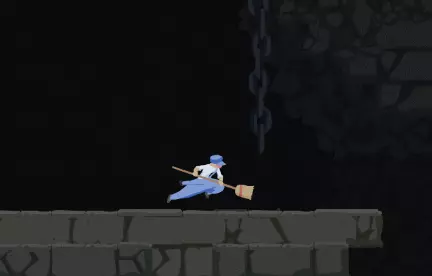

Here you can see me lose some speed when I land on each platform.

\
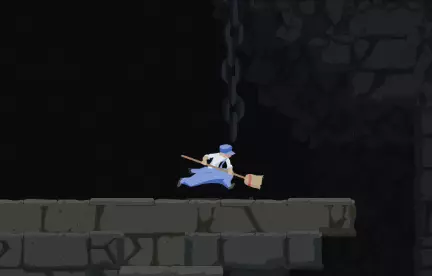

And here even when I lose speed I’m back to running because I dash right after touching the ground.

- - - -

  

<a name="how-dashing-works"/>

### How dashing works ###

While we’re on the topic of dashing, it’s good to understand how exactly it works:

* Ground Dashes
	* If your speed is below your normal running speed it immediately puts you at it and locks your momentum for 12/13 frames (There's 60 frames in a second).
	* The same applies if your speed is above it with one important difference - it locks your momentum at your current speed.
	* You can cancel out of it by jumping, grabbing a wall or attacking.

* Air Dashes
	* Point 1 applies the same.
	* Point 2 is more complicated and I’m not going to get into it in this guide. For now don’t worry about it.
	* You can cancel out of it only by jumping or grabbing a wall (this means that you can attack while dashing).
	
- - - -

  

<a name="downdash"/>

### Downdash ###

Stock tutorials fail to mention it but you can perform a technique called downdash in Dustforce. It gives you significant downwards speed if you didn’t have much of it to being with.

It doesn't require any aircharges (it’s what you use up when you dash or jump in the air), but there is one condition for executing it - your character can’t be rising, or to be accurate, can’t be in a state called raise (more on that in the <a href="https://github.com/czyys/dustforceguide#ledge-cancels-and-mantles">Ledge cancels and Mantles</a> section). This also includes hitrise occurring after you hit most enemies (more on that later as well - <a href="https://github.com/czyys/dustforceguide#hitrise">Hitrise</a>). 

When in the air simply hold ‘down’ and press ‘dash’ to perform a downdash.

Once you downdash any additional downdashes don't give any extra speed, there's no reason to do them.

- - - -

  

<a name="jumping"/>

### Jumping ###

If you’re not sure, for a normal ground jump there are only two kinds of it - low jump (also reffered to as short hop) and high jump. If you hold the ‘jump’ key for the entire duration of jump squat animation (which in a usual scenario lasts 8 frames) you’re going to do a high jump. Holding 'jump' any shorter will result in a low jump.

There is no height you can reach in between them by holding the ‘jump’ key shorter/longer like in some other games. And there is only one kind of airjump, holding 'jump' doesn't affect its height.

If sometimes after jumping off a ledge you don’t seem to be able to double-jump, it’s because you pressed ‘jump’ while already being off the ground. You can differentiate normal groundjump from an airjump by the “cloud” below your character the second one produces.

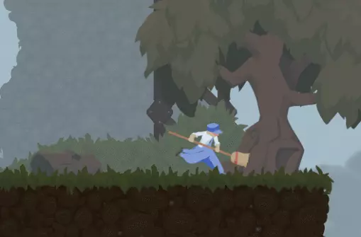

- - - -

 

<a name="neutral-jump"/>

### Neutral jump ###

If you slow down your character to a very low speed and press 'jump' without holding 'left' or 'right' you're going to do what's called a neutral jump. Neutral jump is like any other air jump, except that it sets your horizontal speed to exactly 0.

It has more uses in optimizations and advanced strats done by high level players, but even newer players can use it to easily set up drops like in the clip below.

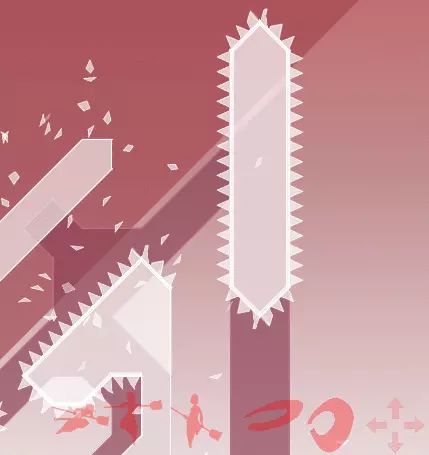

- - - -

  

<a name="wallrun"/>

### Wallrun ###

As you know from the Beginner Tutorial, to start a wallrun you need to hold 'up' and push against the wall. This also includes walls slanted towards the player, even though it may not feel intuitive.

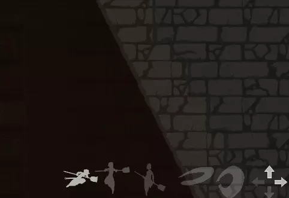

- - - -

  

<a name="walljump"/>

### Walljump ###

The important thing to bring up here is that the sprite of your character doesn’t have to be touching the wall to be able to initiate a walljump. When you’re close enough to a wall, a jump input is going to magnet your character to it. This is why you sometimes might die to a spiked wall even though you’re not touching it.

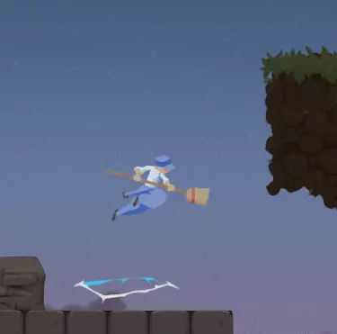

Here’s me walljumping as early as possible.

\
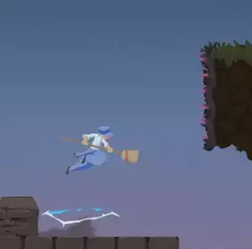

And here’s how it looks like when the wall has spikes.

You can walljump while holding any directions, although holding the direction towards the wall is going to affect your facing (see <a href="https://github.com/czyys/dustforceguide#facing">Facing</a> section below).

Lastly, your speed after walljumping is always the same, it doesn’t matter if you’re holding the direction key away from the wall.

- - - -

  

<a name="walldash"/>

### Walldash ###

To perform a walldash you can’t be holding ‘down’ or the direction towards the wall. If you're having troubles getting walldashes because of this it's usually not a bad idea to not hold any direction keys when starting a walldash. The magneting works exactly the same like with walljumping.

Interestingly you can cancel a walldash with a walljump even after you leave the wall but are still within magneting distance. Make sure to delay jumping after walldashing enough.

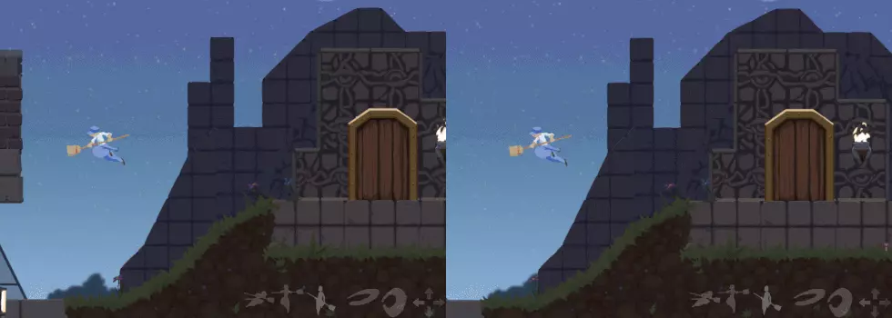

- - - -

  

<a name="corner-boosts"/>

### Corner boosts ###

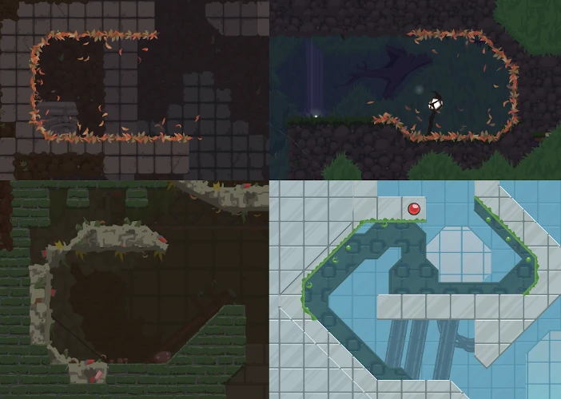

To go fast through sections like the ones from the image above you do what is called a corner boost. This practice map explains how to do them - dustforce://installPlay/9256/GUIDE1 (**Play using Dustman for all of the practice maps**).

Copy the link into your browser's address bar. If you’re having issues installing the map run dustmod.exe as administrator just once.

Just in case here’s a clip of me doing the first one in slow motion, so you can easily follow the input display.

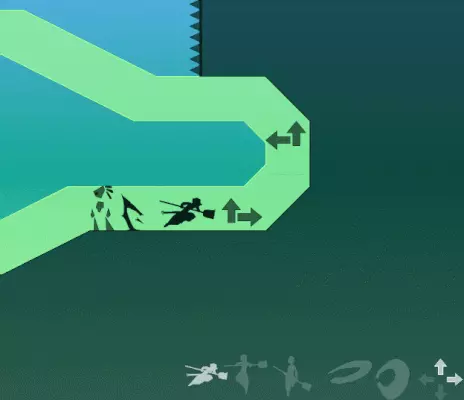

- - - -

  

<a name="ceiling-run"/>

### Ceiling run ###

You may have noticed, that if you ceiling run for too long you start to slow down considerably. That’s because there’s no ceiling friction only for the first 1/3 of a second. After it kicks in you start to slow down and you’re glued to the ceiling (you can’t even downdash) for a short amount of time. It disrupts the flow of the run so make sure to avoid it by releasing the ceiling early enough. 

And here’s another practice map - dustforce://installPlay/9257/GUIDE2

- - - -

  

<a name="ground-boosting"/>

### Ground boosting ###

It’s one of the core techniques of Dustforce and it refers to boosts started on a flat ground. Whether you’re even able to get a groundboost depends on the angle you hit the ground at. Without going into technical details, you have to make sure your horizontal speed is big enough compared to your falling, vertical speed.

To help you understand what I mean by not being able to get a ground boost check out this comparison:

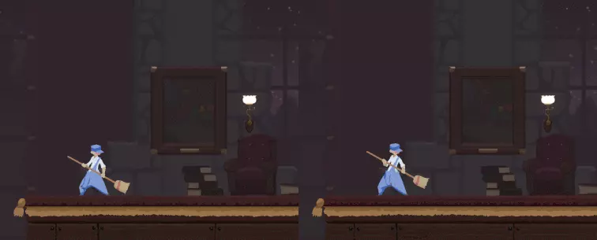

\
In both clips I'm doing basically the same inputs, but I'm downdashing from a little bit higher in the second one. This means my vertical speed keeps increasing after downdashing for longer, and as a result I'm hitting the ground at a slightly too big of an angle for the boost to work. If you can't easily tell that I'm running faster in the left clip then compare where Dustman stops in both examples. 

If the landing angle was good and your character is running faster, simply hold the forward direction key and press 'dash' to keep that speed (you can also still be holding 'down'). The earlier you press 'dash' after landing, the more speed you're going to keep. This applies to any kind of boosts started on the ground.
 
Here’s how you set up groundboosts with each character. It’s pretty much the same for Dustman and Dustgirl:

Dash → Lowjump quickly followed by Airjump → Downdash → Dash when you hit the ground.

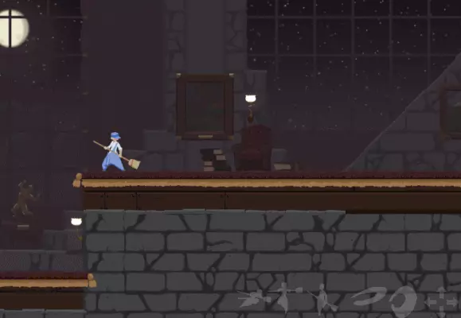

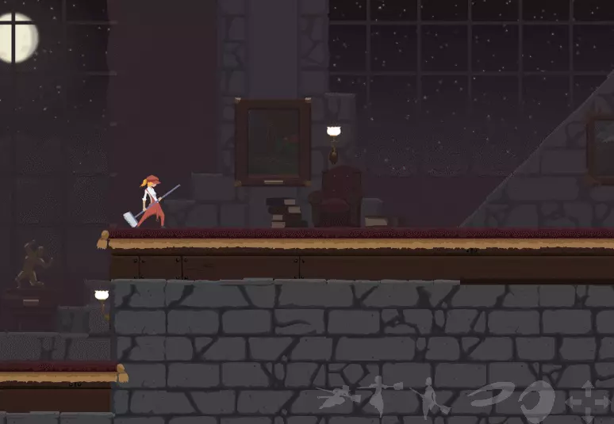

\
Inputs for Dustkid are a bit different:

Dash → Highjump → just before you reach the top of the jump arc Dash -> immediately Jump → Downdash → Dash.

\
Dustworth does the same inputs as Dustman and Dustgirl, but the setup is considerably more difficult. The airjump has to be inputted very quickly, otherwise you'll be too high to downdash immediately and still be able to get the boost. 

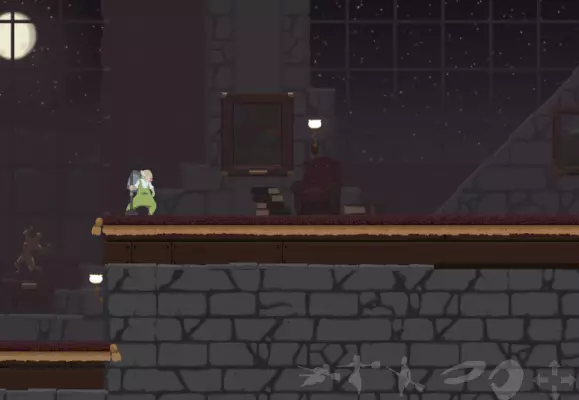

\
You can also of course get ground boosts simply by utilizing the geometry around you, for example by downdashing or simply dropping from a higher platform. For the normal running speed (after you dash from standstill) 5 tiles height is very good to get a boost.

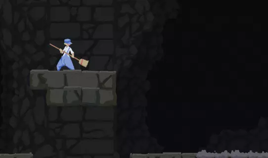

\
Setting up ground boosts is difficult for beginners because it usually requires quick 'jump' inputs and a reasonably well timed dash after landing. It also takes time to get a feel for what horizontal speed you need depending on your height from which you downdash or simply fall. 

- - - -

  

<a name="slope-boosting"/>

### Slope boosting ###

Increasing your speed by landing on a 45o angled ground is called slope boosting. As long as you’re not going backwards you don’t have to worry about the landing angle necessary for the boost to work.

Downdash into a slope holding 'forward' and 'down' and dash when you reach the ground. The bigger the falling speed the bigger the boost is going to be*.

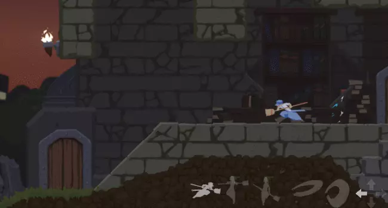

 

Make sure to hold ‘down’ until you leave the slope.

It’s also worth noting that in situations where you can’t get a good slope boost, for example because there’s no way to gain much falling speed and your horizontal speed isn’t big, it’s better to simply slide down the slope (not pressing 'dash' while on the slope).

Sliding down a slope has a relatively low maximum speed and it takes a while to reach it, that's why it’s rarely the optimal strat.

* - This is true for any kind of boost started on the ground, but you have to remember about the big enough horizontal speed requirement the other kinds of boosts have.
- - - -

  

<a name="dash-rhythm"/>

### Dash rhythm ###

If you’ve noticed me chaining dashes together in the last ground boosting clip, it’s how you maintain your speed in Dustforce. Pressing ‘dash’ repeatedly at correct intervals to keep as much speed as possible is referred to as dash rhythm. 

Without going into technical details, optimally dashes are inputted in a pattern of 12 and 13 frames intervals. Ideally you want to dash as soon as previous dash ends, this way you keep all of your speed. The bigger the break between dashing the more speed you lose, but if the break is too small you drop the dash entirely.

If it’s just your beginnings with dash rhythm try to focus on making it consistent and not dropping any dashes rather than going for very good intervals. Delaying the dashes for a few frames doesn’t lose that much time if the boost isn’t long and especially when compared to missing a dash.

Try this practice map - dustforce://installPlay/9258/GUIDE3

And if you want, play this custom map - dustforce://installPlay/4999/Slope-Boost-Rhythm

For practicing extended dash rhythm you can consider enabling Boost Trainer which you can find in Dustmod → Tools. What also helps some players is a 275 BPM metronome playing in the background.

Keeping the dash rhythm makes sense only when you're moving faster than your normal running speed. For example, there's no point in doing it right after you dash from a standstill, and in case of Dustworth it would even be detrimental.

Lastly, don't mash the 'dash' key instead of timing the presses. It's a very bad idea.

- - - -

  

<a name="slant-boosting"/>

### Slant boosting ###

Ground angled at ~26o is referred to as a slant and usually you boost off of it while not having much height. For example downdashing directly from a 5 tiles high platform is too much for normal running speed. In the clip below I’m decreasing my height a bit first.

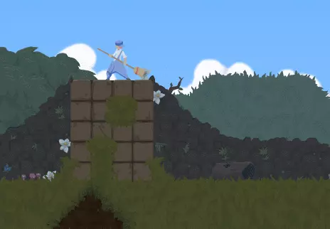

 

Occasionally you're going to come across geometry where slants turn into slopes and vice versa. Because they require different setups for boosting, try to land on the correct one, depending on which boost you're going for.

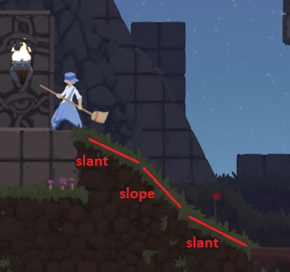

- - - -

  

<a name="ledge-jump"/>

### Ledge jump ###

When you ground jump your character enters jump squat animation before leaving the ground. If you’re boosting and press ‘jump’ the squat is going to kill nearly all of your speed. However you can cancel that animation by leaving the ground before it finishes. You’re going to jump at the very edge and your speed is going to be preserved.

Try it in this practice map - dustforce://installPlay/9259/GUIDE4

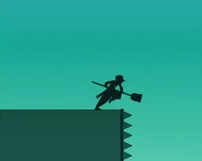

Only 2 frames of jumpsquat, normally it takes 8.

Note that shortening the duration of jumpsquat means you get less time for a potential short hop, since holding the 'jump' key while its animation ends makes you high jump.

- - - -

  

<a name="ledge-cancels-and-mantles"/>

### Ledge cancels and Mantles ###

Dustforce Helpdesk has a very good video about them - https://www.youtube.com/watch?v=7v9-kxYOg0g

Keep in mind mantles are usually much more difficult to execute than ledge cancels. Try to implement them only after getting some more experience with the general movement.

- - - -

  

<a name="slopejump"/>

### Slopejump ###

When sliding down a slope you can jump without going through the jump squat animation. It does however still kill pretty much any boost you might have. 

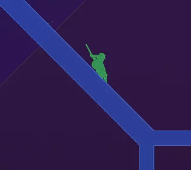

It’s used really only in top runs where every frame matters and jump squat wastes a few. I’m explaining it in this guide though because you might do it accidentally and wonder if something weird didn’t just happen.

- - - -

  

<a name="spikejump"/>

### Spikejump ###

Probably the most popular tech from those which make use of questionable way the game’s logic works in certain situations. It allows you to immediately jump off of slopes (so only ground angled at 45o) even if they have spikes. And it’s fairly easy to perform. 

When you’re in the air and don’t have any aircharges left, land on a slope while holding ‘down’ and ‘jump’. If you used your aircharge on an airjump make sure to also release the ‘jump’ key and hold it again. Spikejumping works only if you’re not rising.

You can control the direction in which you’re going to jump off by holding ‘left’ or ‘right’ or not holding any of them.

Even though it’s called “Spikejump” it works the same way on slopes without spikes.

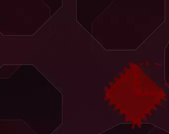

- - - -

  

<a name="zetta-slides-in-zetta-difficult"/>

### Zetta slides in Zetta Difficult ###

I'm making one exception to the rule of not including any level specific help in this case, as vast majority of players going through Zetta Difficult fall victim to what essentially is a bad level design.

It concerns some of the sloped and slanted ceilings where developers put dust right at their beginning, which makes it very easy to miss when you dash after getting the slope boost. Even though you're glued to the ceiling while dashing, you're not actually collecting any dust until after the dash is over. This might cause you to skip some of the earlier dust, like in the clip below.

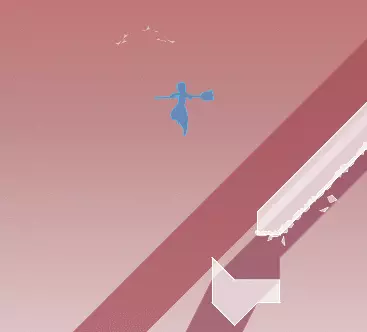

\
For sloped ceilings the easiest solution is to simply not dash after landing a good enough slope boost. In case of the one slanted ceiling though there are 2 ways of dealing with it:
* Landing and dashing near the top of the one-tile slope which makes the dash end in time to still get the dust

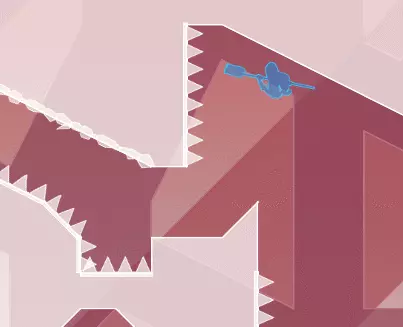

 

* Stopping to clear that dust with an attack, and then setting up a boost with a high jump, like in the replay here - https://dustkid.com/replay/-8403082 (click "Watch Replay" or just find it in-game if you don't use dustmod)

I recommend giving the first option at least a fair try even if you think the other one might be easier.

This section is much easier if you can do maplers and dashjumps (both covered in the "More advanced stuff" part of the guide).

If you can't tell mid-run whether you've gotten all the dust so far, you could try watching some SS replay and making note of what your combo count should be at certain spots where you're free enough to look at the meter in the bottom left.

\
<a name="combat"/>

## Combat ##

<a name="clearing-dust-through-walls"/>

### Clearing dust through walls ###

In Dustforce you can hit enemies through walls, but with up and down attacks you can also clear dust through walls (ceilings and floors too for that matter). It’s extremely useful so always keep it in mind when figuring out strats for a map. 

Play this practice map to test how it works - dustforce://installPlay/9260/GUIDE5

Try replaying it after clearing all the dust to test different attacks. You’re going to notice that for some geometry up and down attacks aren’t the best option.

- - - -

  

<a name="dust-spread"/>

### Dust spread ###

As you know clearing enemies with heavy attacks makes them spread dust on surfaces without spikes. The only things affecting the dust spread are position of the enemy and direction of your attack. Position of your character doesn't matter.

As a sidenote, sideheavies don't spread dust on flat and sloped ceilings.

- - - -

  

<a name="changing-directions-of-attacks"/>

### Changing directions of attacks ###

It’s possible to change the direction of your attack after you’ve initiated it but the new direction has to be inputted within a specific window. 

Changing the direction from forward to back:

* light attack has a 2 frames window
* heavy attack has an 8 frames window

Changing vertical direction:

* light attack has a 2 frames window
* heavy attack has a 4 frames window

As you can see redirecting light attacks is very difficult and it’s something only very good players utilize effectively. 

You also have to keep these windows in mind when you start holding the opposite direction but don’t want to reverse your attack. This concerns heavy attacks in particular.

You can't switch from backlights to forward light or heavy attacks when mashing the attacks. Once you input a backlight you have to wait for its animation to finish (or cancel it early - see <a href="https://github.com/czyys/dustforceguide#canceling-recovery-animations-of-attacks">Canceling recovery animations of attacks</a>) to be able to do a forward attack.

When you want to do a backheavy while moving forward in the air, it’s important to not hold the back direction for too long or you’re going to lose a big chunk of your speed. However if you still have an aircharge, you can dash, then backheavy. It should be much easier to keep your speed this way as dashing locks your momentum for a bit giving you time to input the back direction.

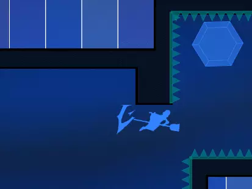

- - - -

  

<a name="super-attack"/>

### Super attack ###

Combat Tutorial doesn’t mention that using the super attack gives back your aircharge/s, even if it doesn’t clear anything. It’s also good to know what its range is more or less, for enemies and for dust.

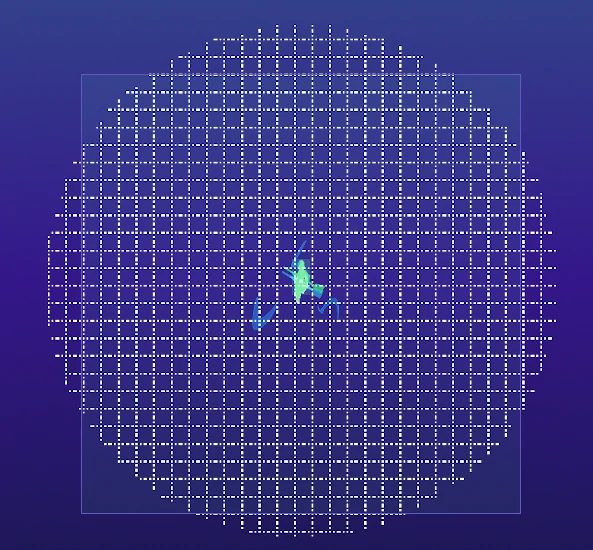

Square checks for enemies, circle for dust and dustblocks. 

There has to be a line of sight between your character and dust for super to clear it.

- - - -

  

<a name="buffering"/>

### Buffering ###

Buffering refers to pressing or holding down a key to start an action before the condition for its start have been met. Once they’re met the action begins immediately.

In Dustforce you can buffer any action (but not in any situation) not related to dashing. Some examples:

* Holding down ‘jump’ while the windup animation of a heavy attack is still in progress. When it finishes you begin the jump.
* Holding down ‘jump’ when out of aircharges and getting close to a wall. Once you’re close enough you start a walljump.
* Pressing the key for a heavy attack while still doing a light attack.
* Spikejump is a buffered slopejump (unless you press ‘jump’ on the very frame you land on the slope).

Buffering inputs is also, or maybe even especially, one of the key aspects of Dustforce as you get past the beginner phase. You often find yourself in situations where you have to wait for one action to finish before starting another. Buffering some inputs ensures that the next action is going to start immediately, without losing precious time.

And remember that when an action requires only a single press to be buffered, once that input is recognized by the game, you can't cancel the buffered action in any way. This coupled with the fact that many actions aren't immediate could explain potential situations where you can't get your character to do what you want.

- - - -

  

<a name="canceling-recovery-animations-of-attacks"/>

### Canceling recovery animations of attacks ###

When you start an attack it goes into its windup animation. After it finishes an enemy gets hit if its hurtbox and hitbox of the attack overlap during that one frame. Then your attack enters the recovery phase during which you can’t start another attack. 

That’s why you often want to cancel the recovery animation and it’s possible to do it with:
* a jump, which can be buffered
* a dash, which has to be timed
* or by grabbing a wall/ceiling, which requires simply holding the right directions.

It gets interesting when you follow up the cancels quickly with another attack. Try this combination:

Jump → Buffer a heavy → During the windup animation buffer another jump and a heavy. 

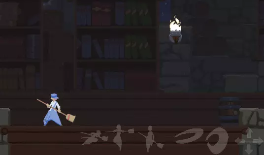

\
Dash canceling is the odd one of the group because it requires timing the press of ‘dash’ after the windup has finished. Try doing this:

Dash → Immediately do a heavy attack → Wait for the windup to finish → Press 'dash' → Immediately heavy again.

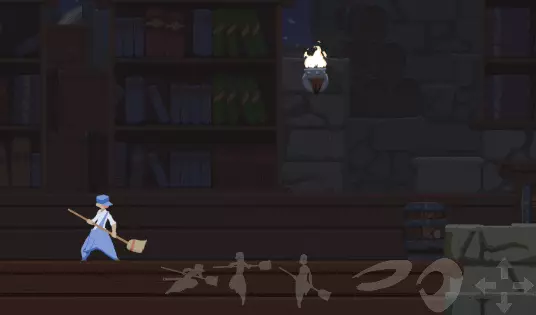

\
It’s a very useful technique for dealing with enemies which take more than one heavy attack to clear. However when timing the dash presses you have to additionally delay them by the duration of hitstop which occurs on each connecting hit (check <a href="https://github.com/czyys/dustforceguide#hitstop">Hitstop</a> section below for more information).

- - - -

  

<a name="spring-blobs"/>

### Spring blobs ###

It's difficult to realize there is a fast and easy way of cleaning this enemy, and spring blobs can be frustrating when you're trying to deal with them the same way as with the other enemies.

What you want to do is to expose the part connecting the blob to the surface with one light attack and cut it with another light attack perpendicular to the stretched out blob. For example uplight -> sidelight or sidelight -> downlight for spring blobs placed on the ground, or sidelight -> uplight when they're on the ceiling.

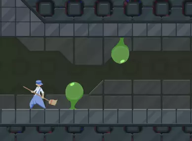

\
Positioning is important, make sure the second light attack hits the spring part.

\
<a name="more-advanced-stuff"/>

## More advanced stuff ##

This section covers tech, which for effective use requires being past the beginner phase of playing Dustforce. It also explains some not obviously apparent mechanics and oddities which are worth being aware of.

  

<a name="holding-left-and-right-at-the-same-time"/>

### Holding ‘left’ and ‘right' at the same time ###

It’s an issue which really can only occur for keyboard players. Sometimes, for example when changing horizontal directions the game might misinterpret your intentions and make your character dash the wrong way. It happens when you’re accidentally holding both ‘left’ and ‘right’ which game treats as not holding any of them. Because of this your character dashes in the direction it was facing originally. For situations like this make sure to release the other direction key early enough.

- - - -

  

<a name="dashjump"/>

### Dashjump ###

(Not to be confused with the dash-jump mentioned in the Advanced Tutorial)

Once again here’s Dustforce Helpdesk video explaining all ins and outs of dashjumping - https://www.youtube.com/watch?v=ElrxwX0gtOg

If you’re having trouble getting dashjumps make sure you’re not holding ‘down’ by accident and check again if your keyboard or controller isn’t ghosting.

- - - -

  

<a name="mapler-slide"/>

### Mapler slide ###

Mapler slide is a technique used to extend the time you ceiling run without friction or simply to get more distance from it. 

You begin the ceiling run holding just ‘up’, then only after a short delay start holding the forward direction key.

Timing on the forward press depends on what you want to use mapler slide for: 
* For keeping speed the optimal delay is 15 frames for non-virtual Dustman, and 10 frames for all the other characters. That’s why from non-virtual characters Dustman is usually the preferred one when maplers are involved. 
* For distance, when you don’t have much speed to begin with, the delay should be longer. 

You can get good at mapler sliding by completing this map - dustforce://installPlay/4970/Mapler-slide-practice

Remember to still hold the forward direction key when slope boosting, then release it and start holding up during the dash.

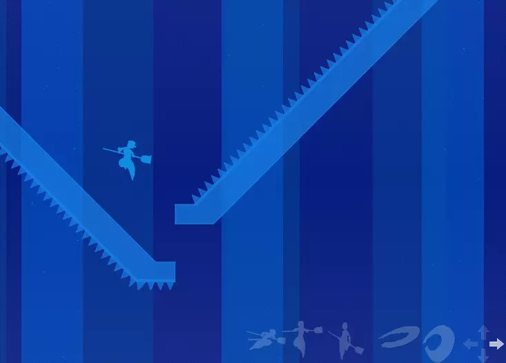

- - - -

  

<a name="hitrise"/>

### Hitrise ###

→ Dustforce Helpdesk video - https://www.youtube.com/watch?v=R_nNLkGVZZU

- - - -

  

<a name="hitstop"/>

### Hitstop ###

When your attack connects with an enemy the game logic slows down almost to a halt for ~3 frames if it’s a light attack and ~8 frames if it’s a heavy attack. During those frames you can’t do anything besides buffering actions.

Another thing worth mentioning is that when buffering a jump + heavy before an attack is going to hit an enemy it’s important to start holding the heavy attack key only after hitstop has already begun. Otherwise buffering actually loses time rather than saving it.

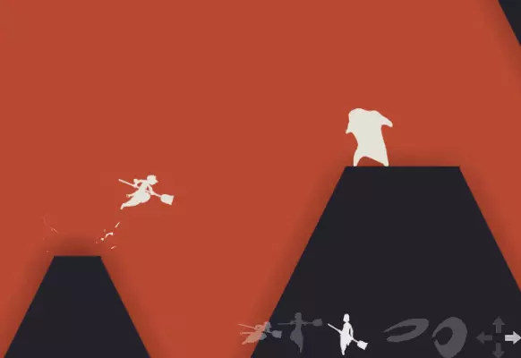

- - - -

  

<a name="jorf"/>

### Jorf ###

You can stand on the corners of spiked tiles.

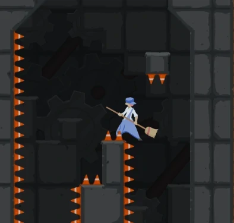

It’s possible to jump and even boost off of jorfs. They’re extremely precise but sometimes they just happen on accident.

- - - -

  

<a name="spikestand"/>

### Spikestand ###

It’s also possible to stand on the corner of slants. Spikestands are less precise to land than jorfs.

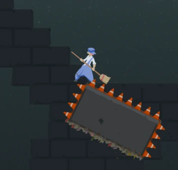

- - - -

  

<a name="clipping"/>

### Clipping ###

And one last time, Dustforce Helpdesk video - https://www.youtube.com/watch?v=W-Zd58F05mU

- - - -

  

<a name="facing"/>

### Facing ###

The direction your character is facing dictates what direction your attack or dash is going to be when you’re not holding ‘left’ and ‘right’.

You change your facing by:

* Running the other way
* Walldashing
* Walljumping (only if not holding the direction towards the wall)
* Corner boosting (the same rule as with walljumping applies) or just ceiling running
* Doing 2 reverse light attacks or a backlight followed by a backheavy (on the ground or in the air)

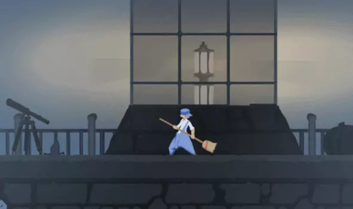

- - - -

  

<a name="deadleg"/>

### Deadleg ###

Bottom left half of your character doesn’t have a hurtbox. What this means is that you can safely touch spikes with that part of your character.

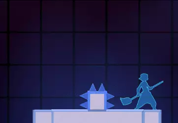

- - - -

  

<a name="super-attack-cancel"/>

### Super attack cancel ###

If you do a super while grabbing a wall and then release it before the attack is finished, you’re going to cancel the super. It has practical use only in a few custom maps where it’s intended but can sometimes happen on accident.

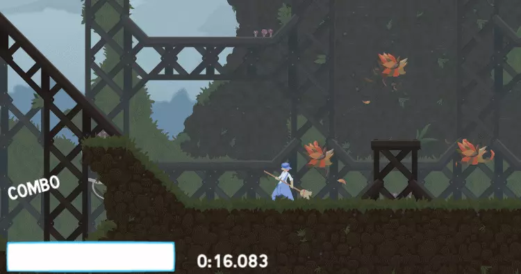

- - - -

  

<a name="time-dilation"/>

### Time dilation ###

Attacking slows down the physics of your character to ~70% for the duration of the attack's windup animation. The timer keeps running normally and all enemies behave normally as well. Check this demonstration:

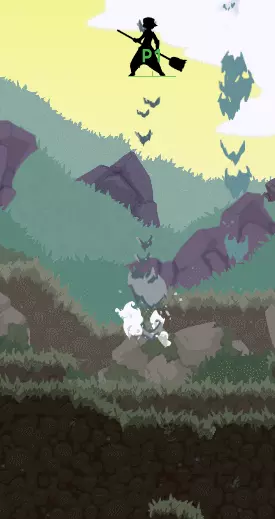

You can see how long it takes Dustman to fall to the ground without and with some attacks. This is why it’s important to try and use attacks only when they can actually save time.

- - - -

  

<a name="left-friction"/>

### Left friction ###

Due to a programming mistake friction while going to the left in the air is considerably more harsh than when going to the right. Check how long it takes Dustman to reach each set of white tiles:

- - - -

  

<a name="iteration-order"/>

### Iteration order ###

It is possible to clear all enemies and dust and get an A completion rank when finishing a map. It’s pretty complicated, so just know that it happens so rarely you probably won't experience it during your first playthrough or maybe even ever. But if it does happen try to do the final attack in a different position, because it might change the iteration order. If it doesn’t help, make sure you are indeed collecting all the dust and try asking people in the community.

Also, if you clear the last enemy before getting all the dust, and then collect it by dropping onto it after you've lost control over your character, it won't count towards the completion. This is normal and it has nothing to do with iteration order.

\
<a name="getting-better"/>

## Getting better ##

<a name="improving-ranks"/>

### Improving ranks ###

Completing the guide up to this point gives you more than enough knowledge to be able to get better effectively. If you’re interested in more than simply beating maps for SS completions, you should be ready to begin focusing on improving your ranks. 

Many players look at their position only on the “Score” (or SS) leaderboards, but I want to bring into your attention the “Time” (or any%) leaderboards as well. The goal is still to beat the map as fast as possible, but here your Completion and Finesse ranks don’t matter (except for when two runs have the same time).

The steps I suggest for improving your runs look like this:

1. Play through a map and figure out what strats you could use.
2. Try getting a clean run with them.
3. Check what rank it gives you and then watch a replay of somebody who is a bit higher on the leaderboard than you.
4. See what they’re doing differently and where they could be saving time.
5. Try to implement those strats into your run.
6. Repeat steps 3-5 until you’re satisfied with your rank.

Better strats alone won’t be enough unless you execute them well, and for this there’s no shortcut. You just have to practice and play the map over and over.

- - - -

  

<a name="using-editor-anywhere"/>

### Using editor anywhere ###

Thankfully you don’t have to play the entire map if you need to practice just one section.

If the “Editor Anywhere” option is enabled in Dustmod menu, you can press ‘tab’ to open the map you’re currently playing in editor mode. Click on the gargoyle icon to select the “Entities” tab, scroll it down to find the Player 1 spawn and place it where you want to start practicing from (you can pan the camera when holding ‘spacebar’ and 'left mouse button'). To change its facing simply press left or right arrow key. Then press ‘tab’ again to switch to playing mode. You can switch between the two modes whenever you want.

If you finish a map from a custom spawn point your run won't submit and completing a level from the original start point while in editor mode makes your run invalidate. You can tell when you're in the editor mode by the flag in the top right corner of the screen. Simply exit the map to quit the editor mode and the flag will be gone.

- - - -

  

<a name="comparing-replays-on-dustkid"/>

### Comparing replays on dustkid.com ###

Dustkid.com allows you to compare any two replays of the same map. If you’re logged in (there should be “My Profile” tab visible on the left) you can easily compare your own replays to other runs. 

First open your profile and select any of the maps you’ve already completed. Then click the camera icon to open a replay of some other player you want to compare your run to. Just above the animation showing the run you’re going to find a few comparison options, among which are "Score PB" and "Time PB" (PB standing for Personal Best). 

You can also compare any two runs, not necessarily yours, by clicking the camera icon while holding left shift to mark it as “Sideboard Replay”. Then open another replay and select "Compare with Sideboard Replay". 

- - - -

  

<a name="replay-ghosts"/>

### Replay ghosts ###

Dustmod includes a feature to watch replay ghosts in-game. Enable “Replay Ghosts” in Dustmod → Tools and start watching any replay. You don’t have to watch it in its entirety, exit the map once it has loaded in. Now select any other replay of this map you’d like to compare it to, or start playing yourself. 

To reset ghosts you have to disable "Replay Ghosts" and enable it.

While active, "Replay Ghosts" invalidate any runs you finish. You can tell if they're active by the tools icon in the top right corner of the screen.

- - - -

  

<a name="other-resources"/>

### Other resources ###

* https://www.youtube.com/channel/UC4H4b4BwJJYmUo_iZwF3WCQ - Dustforce Helpdesk channel has one more video not mentioned here and they may upload something in the future.
* https://www.dustforce.info/ - A Dustforce wiki. It’s still a work-in-progress but it already offers tons of information.
* https://imgur.com/a/jtzG0 - Dustforce Attack Hitbox Sizes and Positions. Although don’t trust the final image as it shows some of the hitboxes incorrectly.
* https://imgur.com/a/mF3HC - Names community has given to each enemy.
* https://www.reddit.com/r/dustforce/ - Dustforce reddit
* https://discordapp.com/invite/0SkxtG7ddS6n2BCW - Invitation link to Dustforce Discord server

- - - -

  

<a name="closing-words-and-credits"/>

### Closing words and credits ###

I hope that what I've written here proves to be useful. Have fun dusting and see you on the leaderboards!

Thank you to Zaandaa, gonx, indapop, Alexspeedy and Skyhawk for suggesting various improvements to the guide.

And finally, some clips in the guide feature custom maps or just fog triggers made by Linley, Leap, C, Giamma, Dustcreep and Alexspeedy.